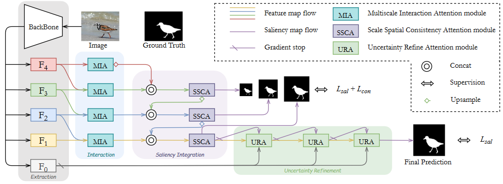
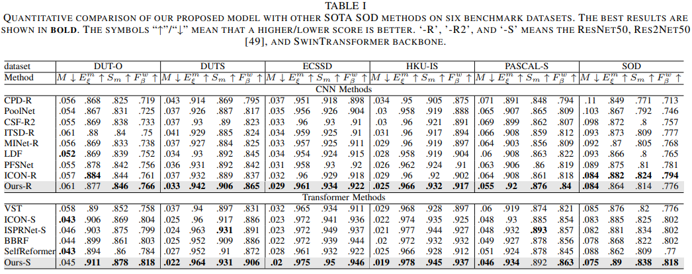
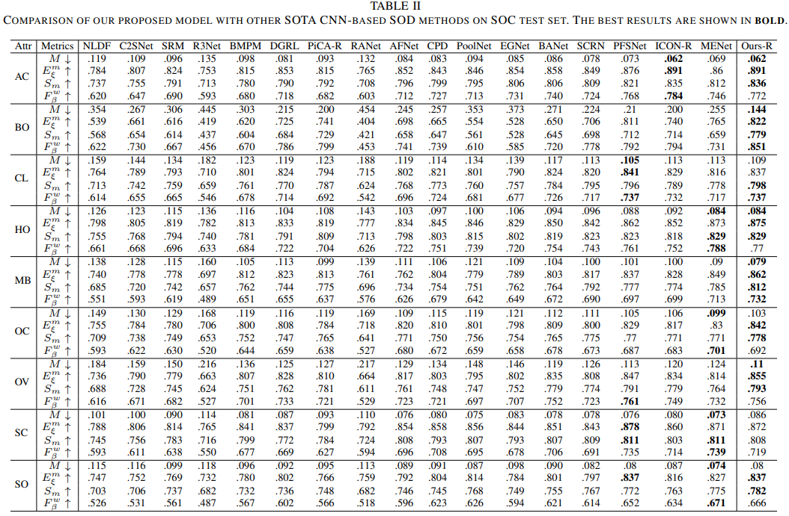
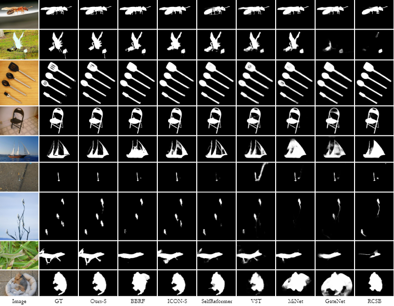

# Uncertainty Guided Refinement for Fine-grained Salient Object Detection
Source code of 'Uncertainty Guided Refinement for Fine-grained Salient Object Detection'. 


## Environment

Python 3.9.13 and Pytorch 1.11.0. Details can be found in `requirements.txt`. 

## Data Preparation
All datasets used can be downloaded at [here](https://pan.baidu.com/s/1fw4uB6W8psX7roBOgbbXyA) [arrr]. 

### Training set
We use the training set of [DUTS](http://saliencydetection.net/duts/) to train our UGRAN. 

### Testing Set
We use the testing set of [DUTS](http://saliencydetection.net/duts/), [ECSSD](http://www.cse.cuhk.edu.hk/leojia/projects/hsaliency/dataset.html), [HKU-IS](https://i.cs.hku.hk/~gbli/deep_saliency.html), [PASCAL-S](http://cbi.gatech.edu/salobj/), [DUT-O](http://saliencydetection.net/dut-omron/), and [SOD](http://elderlab.yorku.ca/SOD.) to test our UGRAN. After Downloading, put them into `/datasets` folder.

Your `/datasets` folder should look like this:

````
-- datasets
   |-- DUT-O
   |   |--imgs
   |   |--gt
   |-- DUTS-TR
   |   |--imgs
   |   |--gt
   |-- ECSSD
   |   |--imgs
   |   |--gt
   ...
````

## Training and Testing
1. Download the pretrained backbone weights and put it into `pretrained_model/` folder. [ResNet](https://pan.baidu.com/s/1JBEa06CT4hYh8hR7uuJ_3A) [uxcz], [SwinTransformer](https://github.com/microsoft/Swin-Transformer) 
are currently supported. <!--, [T2T-ViT](https://github.com/yitu-opensource/T2T-ViT), [EfficientNet](https://github.com/lukemelas/EfficientNet-PyTorch)  -->

2. Run `python train_test.py --train=True --test=True --eval=True --record='record.txt'` for training and testing. The predictions will be in `preds/` folder and the training records will be in `record.txt` file. 

## Evaluation
Pre-calculated saliency maps: [UGRAN-R](https://pan.baidu.com/s/1TOib2DkstrBXuvbEk2tdEg) [b7fx], [UGRAN-S](https://pan.baidu.com/s/1nQFeWXj9_niRlxfsenk3uw) [gfxr]\
Pre-trained weights: [UGRAN-R](https://pan.baidu.com/s/1T_a6e0Gl-y-ux863ZqQZDg) [c3eq], [UGRAN-S](https://pan.baidu.com/s/1HkzImadLxYT_SpFR0pjBMw) [n7tr]

For *PR curve* and *F curve*, we use the code provided by this repo: [[BASNet, CVPR-2019]](https://github.com/xuebinqin/Binary-Segmentation-Evaluation-Tool). \
For *MAE*, *Weighted F measure*, *E score* and *S score*, we use the code provided by this repo: [[PySODMetrics]](https://github.com/lartpang/PySODMetrics). 

<!--For more information about evaluation, please refer to `Evaluation/Guidance.md`.  -->

## Evaluation Results
### Quantitative Evaluation



### Precision-recall and F-measure curves


### Visual Comparison


## Acknowledgement
Our idea is inspired by [InSPyReNet](https://github.com/plemeri/inspyrenet) and [MiNet](https://github.com/lartpang/MINet). Thanks for their excellent works. 
We also appreciate the data loading and enhancement code provided by [plemeri](https://github.com/plemeri), as well as the efficient evaluation tool provided by [lartpang](https://github.com/lartpang/PySODMetrics). 

## Citation
If you think our work is helpful, please cite 

```

```

